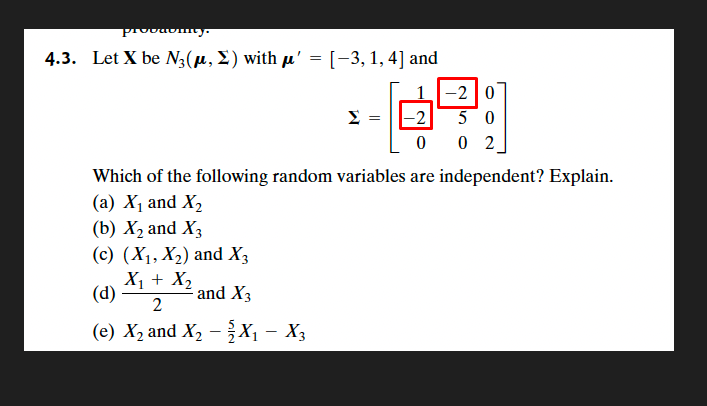

# Ex. 4 Q2  

 <br>  
Let us first define the variables:  
```{r}
mu <- c(-3, 1, 4)

x_1 <- c(1, -2, 0)
x_2 <- c(-2, 5, 0)
x_3 <- c(0, 0, 2)
sigma <- data.frame(
  x_1,
  x_2,
  x_3
)
sigma <- data.matrix(sigma)
```

## a
$X_1$ and $X_2$:

These are not independent since, their covariances are not zero: 
 <br>  

## b
$X_2$ and $X_3$: <br>

These seem to be independent since their co-variance is 0, but it is not given <br>
 <br> 

We can test this by getting the correlation ,matrix using the formula on p. 72 / 110 $P = (v^{1/2})^{-1} \Sigma (v^{1/2})^{-1}$<br> 
Here $(v^{1/2})$ is the inverse of the population standard deviation matrix, which is given by taking the square root of the diagonal for $\sigma$ and letting the rest be 0:  

```{r}
# Get standard deviation matrix
std_dev <- sigma
std_dev[,] <- 0
diag(std_dev) <- sqrt(diag(sigma))
std_dev

# calculate correlation matrix
cor_mat <- solve(std_dev) %*% sigma %*% solve(std_dev)
cor_mat

#The above was just for my own sake to make it easier just use R built in function
cov2cor(sigma)
```

As we can see $X_2$ and $X_3$ has a correlation of zero, so I will conclude that they are most likely independent: <br>
 <br> 

## c 
$(X_1, X_2)$ and $X_3$. Yes since both $X_1$ and $X_2$ are independent from $X_3$. <br>
 <br> 

## d
(($X_1$ + $X_2$) / 2 ) and $X_3$ <br>
Yes again X_1 and X_2 might be dependent, but both variables are still independent from X_3 <br>

## e
$X_2$ and $X_2$ - $5/2X_1$ - $X_3$ <br>
No Since x_1 and X_2 have a strong negative correlation and a shared co-variance they cannot be independent. 