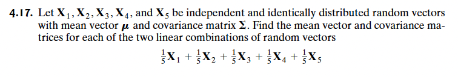
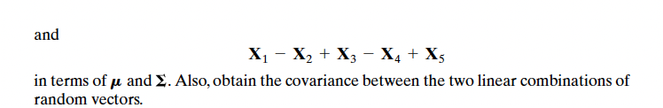

# Question 4

 

 
 
To solve this we follow the procedure from p. 76 / 114 - 77 / 115
 
 

$1/5X_1 + 1/5X_2 + 1/5X_3 + 1/5X_5$

 
 
First off all we need to create our **CX** matrix.
 
 

$$Z_1 = 
\begin{bmatrix}
  1/5 & 1/5 & 1/5 & 1/5 & 1/5
\end{bmatrix}
\begin{bmatrix}
  x_{1}\\
  x_{2}\\
  x_{3}\\
  x_{4}\\
  x_{5}\\
\end{bmatrix}
=
\begin{bmatrix}
  1/5x_{1} + 1/5x_{2} + 1/5x_{3} + 1/5x_{4} + 1/5x_{5}\\
\end{bmatrix}
=CX$$

 
 
Note that 1/5 corresponds to **C**.
 
 
The mean vector is gained this way:
 
 

$$\mu =
\begin{bmatrix}
  1/5 & 1/5 & 1/5 & 1/5 & 1/5
\end{bmatrix}
\begin{bmatrix}
  \mu_{1}\\
  \mu_{2}\\
  \mu_{3}\\
  \mu_{4}\\
  \mu_{5}\\
\end{bmatrix} 
= 
\begin{bmatrix}
  1/5\mu_{1} + 1/5\mu_{2} + 1/5\mu_{3} + 1/5\mu_{4} + 1/5\mu_{5}
\end{bmatrix}
= c´\mu$$

 
 

The variance co-variance matrix is gained this way (p. 76 formula):

 
 

$$\Sigma_{Z_1} =
\begin{bmatrix}
  1/5 & 1/5 & 1/5 & 1/5 & 1/5
\end{bmatrix}
\begin{bmatrix}
  \sigma_{11} & \sigma_{12} & \sigma_{13} & \sigma_{14} & \sigma_{15} \\
  \sigma_{21} & \sigma_{22} & \sigma_{23} & \sigma_{24} & \sigma_{25} \\
  \sigma_{31} & \sigma_{32} & \sigma_{33} & \sigma_{34} & \sigma_{35} \\
  \sigma_{41} & \sigma_{42} & \sigma_{43} & \sigma_{44} & \sigma_{45} \\
  \sigma_{51} & \sigma_{52} & \sigma_{53} & \sigma_{45} & \sigma_{55} \\
\end{bmatrix}
\begin{bmatrix}
  1/5 \\
  1/5 \\
  1/5 \\
  1/5 \\
  1/5 \\
\end{bmatrix}
=C \Sigma_X C^´$$

 
 
Let's do it for the next linear combination.
 
 

$Z_2 = X_1 -X_2 + X_3 - X_4 + X_5$

 
 
Let's get **CX**
 
 

$$Z_2 =
\begin{bmatrix}
  1 & -1 & 1 & -1 & 1
\end{bmatrix}
\begin{bmatrix}
  x_{1}\\
  x_{2}\\
  x_{3}\\
  x_{4}\\
  x_{5}\\
\end{bmatrix}
=
\begin{bmatrix}
  x_1 - x_2 + x_3 - x_4 + x_5
\end{bmatrix}
=CX$$

 
 
Let us now get $\mu$
 
 

$$\mu =
\begin{bmatrix}
  1 & -1 & 1 & -1 & 1
\end{bmatrix}
\begin{bmatrix}
  \mu_{1}\\
  \mu_{2}\\
  \mu_{3}\\
  \mu_{4}\\
  \mu_{5}\\
\end{bmatrix}
= 
\begin{bmatrix}
  \mu_{1} -\mu_{2} + \mu_{3} -\mu_{4} + \mu_{5}
\end{bmatrix}
=c´\mu$$

Let us now get $\Sigma_{Z_2}$
 
 

$$\Sigma_{Z_2} = 
\begin{bmatrix}
  1 & -1 & 1 & -1 & 1
\end{bmatrix}
\begin{bmatrix}
  \sigma_{11} & \sigma_{12} & \sigma_{13} & \sigma_{14} & \sigma_{15} \\
  \sigma_{21} & \sigma_{22} & \sigma_{23} & \sigma_{24} & \sigma_{25} \\
  \sigma_{31} & \sigma_{32} & \sigma_{33} & \sigma_{34} & \sigma_{35} \\
  \sigma_{41} & \sigma_{42} & \sigma_{43} & \sigma_{44} & \sigma_{45} \\
  \sigma_{51} & \sigma_{52} & \sigma_{53} & \sigma_{45} & \sigma_{55} \\
  \end{bmatrix}
\begin{bmatrix}
  1  \\ 
  -1 \\
  1  \\
  -1 \\
  1  \\
\end{bmatrix}
=C \Sigma_X C^´$$

 
 
Lastly we can get the values $\mu$ and $\Sigma$ from both linear combinations
 
 
Let us get **CX**
 
 

$$Z =
\begin{bmatrix}
  1/5 & 1/5 & 1/5 & 1/5 & 1/5 \\
  1 & -1 & 1 & -1 & 1  \\
\end{bmatrix}
\begin{bmatrix}
  x_{1}\\
  x_{2}\\
  x_{3}\\
  x_{4}\\
  x_{5}\\
\end{bmatrix}
=
\begin{bmatrix}
  (1/5x_{1} + 1/5x_{2} + 1/5x_{3} + 1/5x_{4} + 1/5x_{5}) & (x_{1} - x_{2} + x_{3} - x_{4} + x_{5})\\
\end{bmatrix}
=CX$$

 
 
Now let us get $\mu$
 
 

$$\mu_Z =
\begin{bmatrix}
  1/5 & 1/5 & 1/5 & 1/5 & 1/5 \\
  1 & -1 & 1 & -1 & 1  \\
\end{bmatrix}
\begin{bmatrix}
  \mu_{1}\\
  \mu_{2}\\
  \mu_{3}\\
  \mu_{4}\\
  \mu_{5}\\
\end{bmatrix}
=
\begin{bmatrix}
  \mu_{1} -\mu_{2} + \mu_{3} -\mu_{4} + \mu_{5} \\
  1/5\mu_{1} + 1/5\mu_{2} + 1/5\mu_{3} + 1/5\mu_{4} + 1/5\mu_{5} \\
\end{bmatrix}$$

 
 
Now let us get $\Sigma$
 
 

$$\Sigma = 
\begin{bmatrix}
  1/5 & 1/5 & 1/5 & 1/5 & 1/5 \\
  1 & -1 & 1 & -1 & 1  \\
\end{bmatrix}
\begin{bmatrix}
  \sigma_{11} & \sigma_{12} & \sigma_{13} & \sigma_{14} & \sigma_{15} \\
  \sigma_{21} & \sigma_{22} & \sigma_{23} & \sigma_{24} & \sigma_{25} \\
  \sigma_{31} & \sigma_{32} & \sigma_{33} & \sigma_{34} & \sigma_{35} \\
  \sigma_{41} & \sigma_{42} & \sigma_{43} & \sigma_{44} & \sigma_{45} \\
  \sigma_{51} & \sigma_{52} & \sigma_{53} & \sigma_{45} & \sigma_{55} \\
\end{bmatrix}
\begin{bmatrix}
  1/5 & 1  \\
  1/5 & -1 \\
  1/5 & 1  \\
  1/5 & -1 \\
  1/5 & 1
\end{bmatrix}
= 
C \Sigma_X C^´$$

