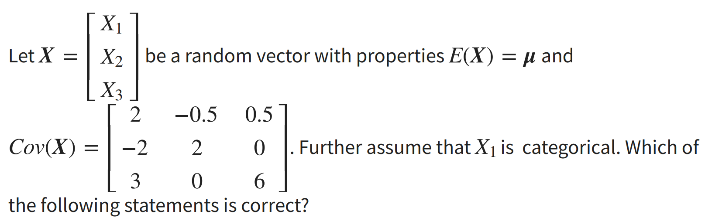
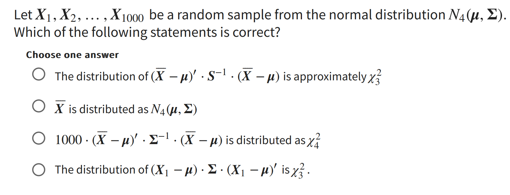

# Test

Lets define helper functions and datasets up here:  

## Data
```{r}
ex_3 <-read.table("Examdata3.tsv", header = FALSE)
ex_4 <- read.table("Examdata4.tsv", header = TRUE)
ex_5a <- read.table("Examdata5a.tsv", header = TRUE)
ex_5b <- read.table("Examdata5b.tsv", header = TRUE)

ex_3
ex_4
ex_5a
ex_5b
```

## Helper functions
```{r}
test_norm <- function(data_vector, name = " ", signigicance = 0.05, rounding = 4) {
  # You can chose the following significance levels
  # 0.01
  # 0.05
  # 0.10
  
  if (signigicance == 0.01){
    signigicance_col <- 2
  }
    
  else if (signigicance == 0.05){
    signigicance_col <- 3
  }
  
  else if (signigicance == 0.1){
    signigicance_col <- 4
  }
    
  
  # ----- QQ plot -----
  qq <- qqnorm(data_vector, plot.it = F)
  
  # ----- Hypothesis test ------
  # Create Testing table
  n <- c(5, 10, 15, 20, 25, 30, 35, 40, 45, 50, 55, 60, 75, 100, 150, 200, 300)
  one <- c(0.8299, 0.8801, 0.9126, 0.9269, 0.9410,
        0.9479, 0.9538, 0.9599, 0.9632, 0.9671,
        0.9695, 0.9720, 0.9771, 0.9822, 0.9879, 0.9905, 0.9935)
  
  five <- c(0.8788, 0.9198, 0.9389,
        0.9508, 0.9591, 0.9652,
        0.9682, 0.9726, 0.9749,
        0.9768, 0.9787, 0.9801,
        0.9838, 0.9873, 0.9913, 0.9931, 0.9953)
  
  ten <- c(0.9032, 0.9351, 0.9503,
        0.9604, 0.9665, 0.9715,
        0.9740, 0.9771, 0.9792,
        0.9809, 0.9822, 0.9836,
        0.9866, 0.9895, 0.9928, 0.9942, 0.9960)
  testing_tbl <- data.frame(
  n,
  one,
  five,
  ten
  )
  
  # Find index of testing (n)
  sample_size <- length(data_vector)
  i <- 1
  prev_value = NaN
  for (n in testing_tbl$n){
    
    if (sample_size > testing_tbl$n[length(testing_tbl$n)]){
      i <- length(testing_tbl$n)
      break
    }
    
    if (n == sample_size){
      exact_sample_size <- TRUE
      break
    }
    
    else if ( n > sample_size & prev_value < sample_size){
      break
    }
    i <- i + 1
    prev_value <- n 
  }
  
  # ----- Normal -------
  cor_coef <- cor(qq$x, qq$y)
  normality = FALSE
  if (cor_coef >= testing_tbl[i, signigicance_col]){
    plot(qq, xlab = "Theoretical quantiles", ylab = "Sample quantiles", main = paste0(name, " QQ plot"))
    qqline(data_vector)
    legend("topleft",
           paste0("Rq: ", round(cor_coef, rounding), "\n",
                  "Test rq: ", testing_tbl[i, signigicance_col], "\n",
                  "Alpha: ", signigicance, "\n",
                  "n: ", n, "\n",
                  "NORMAL!"),
           cex = 0.65,
           bty = "n")
    normality = TRUE
    return(normality)  
  }
  
  # ----- Not normal -----
  else {

    plot(qq, xlab = "Theoretical quantiles", ylab = "Sample quantiles", main = paste0(name, " QQ plot"))
    qqline(data_vector)
    legend("topleft",
           paste0("Rq: ", round(cor_coef, rounding), "\n",
                  "Test rq: ", testing_tbl[i, signigicance_col], "\n",
                  "Alpha: ", signigicance, "\n",
                  "n: ", n, "\n",
                  "Not NORMAL!"),
           cex = 0.65,
           bty = "n")
  }
}
```


# Q 1. p. 2
The data of this exercise is provided in Examdata4.tsv. All numerical values are rounded to 4 decimal places. Which of the following statements is not correct?

## The correlation coefficient r_q for the QQ plot of X_2 is 0.9978

**TRUE** the r_q is 0.9978, this can be seen when performing the qqplot test with my function test norm: <br>
```{r}
test_norm(ex_4$X2, rounding = 4, name = "X2") # rounding = 4 us defualt just showing it to display it for later
```  

## X_1 is normally distributed with significance level of 0.05  
**TRUE** Since there are 150 entries the rq must be higher than .9913, and since it is 0.9944 it is normally distributed: <br>
```{r}
test_norm(ex_4$X1, name = "X1")
```  
## X_2 is normally distributed with significance level 0.05  
**TRUE** with a significance level of 0.9978, it is higher than 0.9913  
```{r}
test_norm(ex_4$X2, name = "X2")
```
## X_3 is normally distributed with significance level 0.1
**FALSE** Since the significance is 0.1 it must be higher than 0.9928, however it is only 0.9754  

```{r}
test_norm(ex_4$X3, signigicance = 0.1, name = "X3")
```

# Q2 p. 3
Assume that we have data that can be classified into 2 groups. Three classification methods (Method 1, Method 2 and Method 3) are applied to this data set. Their performance are evaluated according to their AUC (area under the curve) values, i.e. <br>

- Method 1: 0.8 AUC <br>
- Method 2: 0.85 AUC <br>
- Method 3: 0.90 AUC <br>
<br>
Which method performs the best? <br>

## Q2 answer  
Method 3 is the best, since its AUC is closer to 1.  

# Q3 p. 4
The data of this exercise is provided in Examdata5a.tsv and Examdata5b.tsv. We want to test the equality of their covariance matrices with significant level 0.05 assume that data are normally distributed. Null hypothesis is that their covariaance matrices are equal, what is the correct conclusion based on the Box's M-test. <br> <br>

We will perform the chi-squared test with a custom funciton. This function expects to have one dataframe with all the values and a second vector or matrix or column, which contains the group of each observation. Therefore we have to combine the dataframes and give them a second column which contains what group / data set they belong to:  

```{r}
ex_5a["group"] <- 1
ex_5b["group"] <- 2
ex_5_full <- rbind(ex_5a, ex_5b)
ex_5_full[, 3]
```  
We can now use the package:  
```{r}
box_m_test <- function(df, group_index, significance = 0.95){
  #This takes the full dataframe and the index of the column which contains the groups
  
  n <- nrow(df)
  p <- ncol(df[, -group_index])
  groups <- unique(df[, group_index])
  g <- length(groups)
  
  # get w
  w <- 0 
  for (group in groups){
    mask <- df[,group_index] == group
    group_df <- df[mask, ]
    n_g <- nrow(group_df)
    s_g <- cov(group_df[, -group_index])
    w <- w + (n_g - 1) * s_g
  }
  # get w
  spooled <- w/(n - g)
  
  # get M
  M_sum <- 0
  for (group in groups){
    mask <- df[,group_index] == group
    group_df <- df[mask, ]
    n_g <- nrow(group_df)
    s_g <- cov(group_df[, -group_index])
    M_sum <- ((n_g - 1) * log(det(s_g))) + M_sum
  }  
  M <- (n-g)*log(det(spooled)) - M_sum
  
  # get u
  sum_u <- 0
  for (group in groups){
    mask <- df[,group_index] == group
    group_df <- df[mask, ]
    n_g <- nrow(group_df)
    s_g <- cov(group_df[, -group_index])
    sum_u <- sum_u + (1/(n_g - 1))
  }  
  u <-  ( sum_u - 1/(n-g)) * ( (2*p^2 + 3*p - 1) / (6*(p+1)*(g-1)))

  # Test statistic
  C <- (1-u)*M
  
  # Critcal value v
  critvalue <- qchisq(significance,p*(p+1)*(g-1)/2)   #v=p*(p+1)*(g-1)/2#
  
  ### final decision ####
  decisionflag <- (C > critvalue)
  
  writeLines(paste0("u :                          ", u, "\n",
                    "M statistic:                 ", M, "\n",
                    "C value (Chi-squared value): ", C, "\n",
                    "Critival value (v):          ", critvalue, "\n",
                    "Equal covariance matrices:   ", decisionflag, "\n"))
}
```
We have to hypothesis: <br>
- h0: The covariance matrices are equal  
- h1: at least two of the covariance matrices are not equal <br>
We can see if the approximated chi-squared value (C) is above the critical chi squared value for significance 0.05. If the value is above we accept h0 otherwise we reject h0: <br> 

```{r}
box_m_test(ex_5_full,
           group_index = 3,
           significance = 0.95)
```

As we can see the current chi value (5.3383) is below the critical chi-value (7.815), so we have to reject the null hypothesis. At least two of our co-variance matrices are not equal <br>

# Q4 . p. 5



## X_2 amd X_3 are uncorrelated  
**TRUE** since both of them have are covariance of zero, they cannot have a direct correlation, since their variance does not differ together. 
## X_2 and X_3 are independent  
**TRUE** since they have zero covariance it is pretty safe to assume independence (p. 107)

## The standard deviation of X_1 is 2
**FALSE* The standard deviation is defined as the square root of the variance. so let us calculate it <br>

```{r}
sqrt(2)
```
No the standard deviation is 1.41, but it does not make much sense to talk about, since it is categorical 

## There is a positve correlation between X_1 and X_2 
No, since their co-variance is negative it cannot be positive. Moreover, x1 is categorical, which again does not make sense to talk about correlation.

# Q. 5 p. 7
The data of this exercise is provided in Examdata3.tsv. All numerical values in the following are rounded to 4 decimal places. PCA analysis is done without standardization. Which of the following statements is not correct?

## The correlation coefficient between the second prinicpal component and X_3 is negative  
**FALSE** From a theoretical point of view principal components should not be able to be correlated, since the point of the dimension reduction is to only group correlated variables together, so each component is comprosied of different variables that are correlated. (see pca.pdf)  

## The first principal component is clearly dominant, since it explains more than 95% of the total variance
**TRUE** by looking at the summary of the principal component it it cleat that it explains +96% of the variance.
```{r}
pc_ex3 <- prcomp(ex_3)
summary(pc_ex3)
```
## The first principal component is 0.6831X_1 + 0.5102X_2 + 0.5223X_3
**FALSE** when looking at the principal component it is ALMOST but not quite the coefficients above it is 0.6831X_1 + 0.5102X_2 + **0.5225X_3**
```{r}
pc_ex3
``` 
## The sample mean vector is (4.7254, 4.4776, 3.7032)′)
**TRUE** We can check the mean vector of the original dataset:  
```{r}
colMeans(ex_3)

```
When this is rounded off to 4 decimals, it will yield the same sample mean vector.  

# Q. 6 p. 10


## a)
**FALSE** the distribution is **$X_{4}^2$** NOT $X_{3}^2$  

## b)
**TRUE** The sample mean vector will likewise follow the four variate normal distribution, since any subvector of a normal distributed vector will be normally distributed.  

## c) 
**TRUE** even though the distribution is scaled it will still follow the same distribution.  

## d)
**FALSE** the distribution is **$X_{4}^2$** NOT $X_{3}^2$

