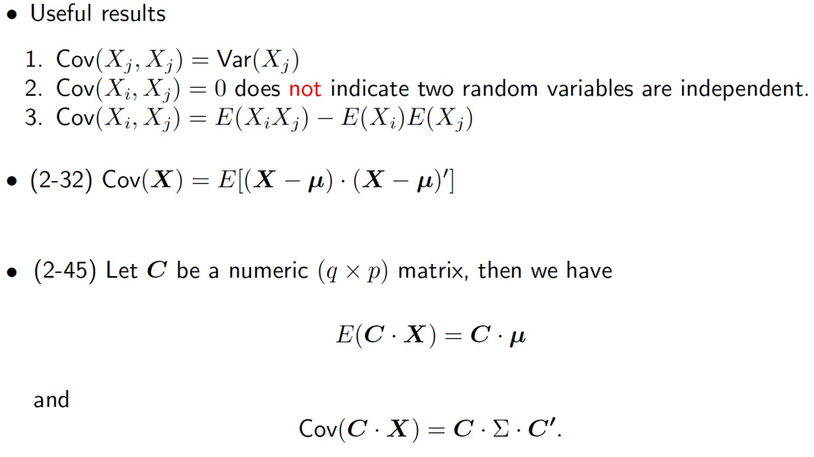

# Notes compilation
This is a collection of all notes for the course Multivariate statistics at SDU. Goal of the course is to learn how to perform classification and analysis of multiple dependent variables.  

# Chapters from book  
- Chapter 1, 2, 3 (Algebra, random vectors and desciptive statistics) <br>
- Chapter 4 (MVN / Multivariate normal distribution) <br>
- Chapter 5 and 6 (Inferences about mean vectors) <br>
- Chapter 8 (Principle components) <br>
- Chapter 11 (classification and discrimination) <br>

# Intro and notation
The goal of statistics is to make inferences about a population using a sample population.  
Data is always split into data matrices:  

  

Notation:  
  

## Sample mean vector $\bar{x}$
Marks the central point of the data:  
  

It is the average of each attribute / column and it has the following formula:  
  

The r code is **colMeans()**  

For the population mean vector we usually use $\mu$

### Expected values  
The expected values of the population should be approximately the mean of the sample vector if the sample is large enough, therefore, we use it as an estimator for the population sample mean. Moreover: we have the following rules:  

  

### Scaling sample mean
Scaling the sample mean is done by standard matrix multiplication:  
  


## Variance  
The variance measures how much the data spreads:  
  
Is has the formula for an biased estimator as:  

  

For the sample use an unbiased estimator:  
  
## Covariance  
Describes the connection between the variance of two or more variables ie. how is their variance connected.  
This is useually displayed in the variance-covariance matrix. The calculation is the following for the biased estimator:  
  

The unbiased:  
  

The covariance describes how much two variables differ from their mean sample:  
  

It is displayed in a covariance matrix:  
  

This matrix is symetrical and describes the covariances between each of the variables.  

The generalized variance is the determinant of the covariance matrix.  
The total sample variance is the sum of the diagonal of the covariance matrix:  
  

The covariance can be used to display the correlation if it is positive their might be a positive correlation, if it is negative there might be a negative. But the correlation matrix is more efficient for this. However, a 0 covariance might not mean that they are independent or uncorrelated since they could have a non-linear relationship. Moreover, the scale of the data might make the number higher or lower, so it is not a good indikator. Luckily the correlation coefficient matrix makes sure, that the scale of the data points does not matter.  

The covariance matrix for the population is usually written as $\Sigma$  

The R code is **cov()**  

### Rules to remember  
  
    


### Scaling 
The formula for scaling the covariance matrix is this:  
  

## Correlation  
The correlation between two variables is a measure of their linear relationship. It is the variance divided by the standard deviation of each variable multiplied with each other:  
  

It can be between -1 and 1 and describes how strongly correlated two variables are:  
   

The correlation matrix displays the relationship between each variable:  
  

The R command is **cor()**  

## Central limit theorem  
It basically states that if you have a large enough sample with independent variables its sample mean vector will at some point approximate a normal distribution, if it gets large enough:  

   

# Normal distributions  
Notation: $N_p$(mean_vector, variance).  

We want to test for normality since it has some usefull properties and since a lot of methods are made for normally distributed data.  

When testing for normality we have the following hypothesis:  

h0: Data IS normally distributed  
h1: Data is NOT normally distributed  

The test statistic is $r_q$  

The r_q value must be greater than a critical value.  
We usually use a qq-plot for this. The qq-plot 

We accound for how high a risk of being wrong we want to take with the significance or alpha value. 0.05 is the most common and means that we will be wrong 5% of the time. 

## QQ-plot  
Står for Quantile function. It plots the quantile densitiy function (QDF) of the sample against the theoretical QDF and then sees how correlated these two values are, if their rq value is higher than our rejection region we accept h0.  

   
The reason this works is that if we know the QDF we can get the probability density function (PDF), which is the one, that show if our data is normally distributed. So a PDF has a QDF, but since we don't know the PDF, we can luckily obtain it by getting the QDF and that will tell of if the PDF is a normal distribution function.

## $(r_q)$
The correlation coeefficent must have values higher than in this table for a chosen significance level:  

  

## Test univariate normality in R:  
Use the following code to test for univariate normality:  

```{r}
test_norm <- function(data_vector, name = " ", signigicance = 0.05, rounding = 4) {
  # You can chose the following significance levels
  # 0.01
  # 0.05
  # 0.10
  
  if (signigicance == 0.01){
    signigicance_col <- 2
  }
    
  else if (signigicance == 0.05){
    signigicance_col <- 3
  }
  
  else if (signigicance == 0.1){
    signigicance_col <- 4
  }
    
  
  # ----- QQ plot -----
  qq <- qqnorm(data_vector, plot.it = F)
  
  # ----- Hypothesis test ------
  # Create Testing table
  n <- c(5, 10, 15, 20, 25, 30, 35, 40, 45, 50, 55, 60, 75, 100, 150, 200, 300)
  one <- c(0.8299, 0.8801, 0.9126, 0.9269, 0.9410,
        0.9479, 0.9538, 0.9599, 0.9632, 0.9671,
        0.9695, 0.9720, 0.9771, 0.9822, 0.9879, 0.9905, 0.9935)
  
  five <- c(0.8788, 0.9198, 0.9389,
        0.9508, 0.9591, 0.9652,
        0.9682, 0.9726, 0.9749,
        0.9768, 0.9787, 0.9801,
        0.9838, 0.9873, 0.9913, 0.9931, 0.9953)
  
  ten <- c(0.9032, 0.9351, 0.9503,
        0.9604, 0.9665, 0.9715,
        0.9740, 0.9771, 0.9792,
        0.9809, 0.9822, 0.9836,
        0.9866, 0.9895, 0.9928, 0.9942, 0.9960)
  testing_tbl <- data.frame(
  n,
  one,
  five,
  ten
  )
  
  # Find index of testing (n)
  sample_size <- length(data_vector)
  i <- 1
  prev_value = NaN
  for (n in testing_tbl$n){
    
    if (sample_size > testing_tbl$n[length(testing_tbl$n)]){
      i <- length(testing_tbl$n)
      break
    }
    
    if (n == sample_size){
      exact_sample_size <- TRUE
      break
    }
    
    else if ( n > sample_size & prev_value < sample_size){
      break
    }
    i <- i + 1
    prev_value <- n 
  }
  
  # ----- Normal -------
  cor_coef <- cor(qq$x, qq$y)
  normality = FALSE
  if (cor_coef >= testing_tbl[i, signigicance_col]){
    plot(qq, xlab = "Theoretical quantiles", ylab = "Sample quantiles", main = paste0(name, " QQ plot"))
    qqline(data_vector)
    legend("topleft",
           paste0("Rq: ", round(cor_coef, rounding), "\n",
                  "Test rq: ", testing_tbl[i, signigicance_col], "\n",
                  "Alpha: ", signigicance, "\n",
                  "n: ", n, "\n",
                  "NORMAL!"),
           cex = 0.65,
           bty = "n")
    normality = TRUE
    return(normality)  
  }
  
  # ----- Not normal -----
  else {

    plot(qq, xlab = "Theoretical quantiles", ylab = "Sample quantiles", main = paste0(name, " QQ plot"))
    qqline(data_vector)
    legend("topleft",
           paste0("Rq: ", round(cor_coef, rounding), "\n",
                  "Test rq: ", testing_tbl[i, signigicance_col], "\n",
                  "Alpha: ", signigicance, "\n",
                  "n: ", n, "\n",
                  "Not NORMAL!"),
           cex = 0.65,
           bty = "n")
  }
}
```

## Transformation  
Data can be transformed if it is not normally distributed. This is NOT data manipulation, since we are working with the whole dataset rather than selecting specific values.Moreover, in some cases it might be necessary to remove outliers. If done right, this is fine, but wathch out, since it can be to much.  

### Box cox transformation  
  


The R code for box cox transformation is the following:  

```{r}
library(MASS)

get_best_lambda <- function(data_vector, name = "")  {
    # Transform data
    # Make box cox plot on our data
    df_box_cox<- boxcox(data_vector~1,lambda=seq(-2, 2, 1/10))# Can also be seq(-.5, 1.5,.01) 
    
    # Get best lambda
    max_lambda <- df_box_cox$x[which.max(df_box_cox$y)]

    legend("left",
           paste0(name, " Best lambda", "\n",
                  "The best lambda is ", round(max_lambda, 3), "\n"),
           cex = 0.75,
           bty = "n")
    return(max_lambda)
}

box_cox_transformation <- function(data_vector, name = ""){

  lambda <- get_best_lambda(data_vector, name)
  if (lambda == 0){
    transformed_vector <- log(data_vector)
  }
  
  else {
  transformed_vector <- ( (data_vector^lambda) - 1)/lambda
  }
  
  return(transformed_vector)
}
```

It requires the library MASS and when you use the function *box_cox_transformation()* use it on each column individually.  

## Multivariate normal distribution  
Bivariate normal distribution resembles a "mountain":  
  
If we look at a sliced version of this, we will se that all points are withing an elipsoid:  

  
The formula for this is:  
   
In one dimension this is:  
   

This is acutally a chi-squared distribution:  
  

The mahalanobis distance aka. statistical distance, is the same formula, so if we get the mahalanobis distance of each point to the mean they should follow a chi square distribution, where each point lay correctly distributed in an elipsoid:  

  

This is gives the following distiance  

 
The euclidean distiance is:  
  
  

So we get a critical value and evaluete that enough points are within that area, theoretically 1 - $\alpha$ (or significance) should be witin the contours, but in practice we simulate how many.  

What we then do is to plot the sample mahalanobis distance contra the theoretical chi-squared distribution and see if their correlation is strong enough on a qq plot. This is done by simulating the rq values many times and finding a critical rq.  

  

### Properties of MVN  
  

  

  

  


### Central limit theorem MVN  
The central limit theorem likewise applies to multivariate normal distributions. But here it will follow either a normal distribution or a chi-square distribution depending on what we want to have:  
  

### Test for MVN  
We need four steps to evaluate MVN:  

1. Check normality for each attribute  (done with the code)
2. Check normality for each pair of the two attributes  
3. Check normality for the entire four attributes   

```{r}

FindcrikChi <- function(n=30, p=2, alpha= 0.05, n_simulations=10000){
    
    cricvec <- rep(0, n_simulations)  #vector for the rQ result collection#
    
    for(i in 1:n_simulations){
        #iteration to estimate rQ#
        numvec <- rchisq(n, p)  #generate a data set of size n, degree of freedom=p#
        d <- sort(numvec)
        q <- qchisq((1:n-0.5)/n, p)
        cricvec[i] <- cor(d,q)      
    }
    
    scricvec <- sort(cricvec)
    cN <- ceiling(n_simulations* alpha) #to be on the safe side I use ceiling instead of floor(), take the 'worst' alpha*N cor as rQ, everything lower than that is deemed as rejection#
    cricvalue <- scricvec[cN]
    result <- list(cN, cricvalue, scricvec)
    return(result[[2]])
}

multi_var_norm <- function(df, sim_cor, alpha, name, remove_outlier = FALSE, n_outliers = 1) {
  
  # Data and parameters
  n <- nrow(df) # observations
  p <- ncol(df) # number of variables
  D2 <- mahalanobis(df,
                    center  = colMeans(df),
                    cov = cov(df),
                    tol=1e-20) # generalized squared distance
  # Removes outliers if necessary
  if(remove_outlier == TRUE){
    
    i = 0
    while (i < n_outliers){
    #This is where we remove outliers. This will most likely change the correlation value and the % number of points in the contour. 
    D2 <- D2[-which.max(D2)]
    i = i + 1
    }
  } 
  
  # Chi square qq plot 
  chi_plot <- qqplot(qchisq(ppoints(n, a = .5), df = p), D2,
                     plot.it = F) # chi square plot values.
  my_cor <- cor(chi_plot$x, chi_plot$y) # correlation value
  critical_value <- qchisq(p = alpha,
                           df = p,
                           lower.tail = F) # calculate critical value
  
  # Proportion of points below alpha value
  prop_within_contour <- round(length(D2[D2 <= critical_value]) / length(D2),4) #

  quantiles <- quantile(D2)
  quantile_25 <- quantiles[2]
  quantile_50 <- quantiles[3]
  quantile_75 <- quantiles[4]
  
  plot(chi_plot, #From here and downwards it is only how you want the plot to look. 
       ylab = 'Mahalanobis distances',
       xlab = 'Chi-square quantiles',
       main = paste0(name, ' alpha = ',alpha)) # plot chi square plot
  
  # Q line
  y <- rchisq(500, df = p)
  qqline(y, distribution = function(n) qchisq(n, df = p), prob = c(0.1, 0.6))
  
  # Lines for quantiles
  abline(h = quantile_50, lty = 2) # 50% quantiles becayse book p. 187
  abline(h = critical_value, lty = 2, col = "red") # Below Critical value
  
  if(my_cor > sim_cor){
    conclusion <- "Normally distributed!"
  }
  
  else {
    conclusion <- "NOT normally distributed!"
  }
  legend("topleft", 
         paste0("r = ", round(my_cor,4), "\n",
                "Simulated r Value: ", sim_cor, "\n",
                "% Below critical range: ", prop_within_contour, "\n",
                "Expected if normal: ", 1-alpha, "\n",
                conclusion),
         cex = 0.75,
         bty = "n") # add legend to plot
}


bivar_pairs <- function(data_frame, significance = 0.05, remove_outliers = FALSE, n_outliers = 1, n_simulations = 10000) {

sim_cor <- FindcrikChi(n = length(data_frame[,1]),
                          p = 2,
                          alpha = significance,
                          n_simulations)

prev <- c()
i = 1
for (col_name in colnames(data_frame)){

  j = 1
  for (col_name_inner in colnames(data_frame)){
    
    if (i == j){
      j = j + 1
      next
    }
    
    else if (j %in% prev){
      j = j + 1
      next
    }
    
    else{
      multi_var_norm(df = data_frame[, c(i, j)],
                 sim_cor = sim_cor,
                 alpha = significance,
                 name = paste0(col_name, " & ", col_name_inner, " "),
                 remove_outlier = remove_outliers,
                 n_outliers = n_outliers)
      
    }
    j = j + 1
  }
  prev <- append(prev, i)
  i = i + 1
  }
}

```

# Partition matrix  
MAtrices can be partitioned like this:  
  

    


# Linear combinations  

If we have random vectors that are normally distributed then a linear combination of these will likewise be normally distributed:  
  

# Law of large number (LLN)  
This law states that as the sample size increase the closer our sample mean vector will get to our population mean vector, and the closer our sample variance - covariance matrix will get to our population variance - covariance matrix.  

  


# Classification / Discrimination  
Classificaiton and discrimination is NOT the same. Discrimination tries derive rules to seperate KNOWN observations as much as possible, while classification tries to derive rules that can seperate and label NEW observations.   

## ECM (Expected costs of misclassification)  
Most classifiers tries to minimize the risk of misclassification, this is done by creating a hyperplane which makes sure that as few observations as possible are misclassified. They try to minimize the expected cost of misclassfication. The ECM takes into account the proportions of each class, so that each class is assigned a weight according to their size. They can also be predefined, but that is beyond our scope.  

  

  
There are some special cases of ecm:  

  
Here is an example:  

  
If there are more than three groups the ECM is  

  

## Models  
We have three different models:  

### LDA (Linear discriminant analysis)  
Tries to assign a object the grouping that is nearest. It is used when there is equal variance covariance among the groups and it expects that the data is normally distributed.  

  


### QDA (Quadratic disciminant analysis)  

This is best if the groups have unequal covariance matrices. It expects that the data is normally distributed. Not sure about the formula but here it is:  

  

### Logistic regression  
It assigns a probabilty of each class to the observatoin and selects the one with the highest chance.  

  

## Evalutaion  

### APER (Apparrent Error Rate)
Here we split our data into 70% training and 30% percent test. We train on the 70% data and evaluate on the 30% test. The APER is the apperant error rate which is just misclassifications divided by number of samples:  

  

Here is the R code:  

```{r}
aper <- function(preds, obs){
  n_misclassifications <- 0
  i <- 1
  for (val in preds){
    
    if (val != obs[i]){
      n_misclassifications = n_misclassifications + 1
    }
    
    i = i + 1
  }
  return(n_misclassifications / length(preds))
  
}

acc <- function(preds, obs){
  correct <- 0
  i <- 1
  for (val in preds){
    
    if (val == obs[i]){
      correct = correct + 1
    }
    
    i = i + 1
  }
  return(correct / length(preds))
}

confusion_matrix <- function(preds, observed){
  # Alternatively user this code below
  # library(caret)
  # confusionMatrix(as.factor(predictions$class), as.factor(observed))
  return(table(preds, observed))
}
```

### E(AER) (Expected Apparent Error Rate)  
The expected apparent error rate is also known as cross validation or hold one out. Here we hold out one data observation and train the model. We then predict the hold out observation. We do this for the whole data set and say number of misclassifications divided by number of observations:  

  

Here is the R code for it:  

```{r}
library(nnet)
EAER <- function(data_frame, model_type = "lda") {
  
  n_misclass <- 0
  for (i in 1:nrow(data_frame)) {
    temp_data <- data_frame[-i,]
    if (model_type == "lda"){
      model <- lda(V11~., data = temp_data)
    }
    else if (model_type == "qda"){
      model <- qda(V11~., data = temp_data)
    }
    else {
      temp_data$V11 <- as.factor(temp_data$V11)
      model <- multinom(V11~., data=temp_data, trace = FALSE)
    }
    pred <- predict(model, data_frame[i,], type = "class")
    
    if (model_type != "lda" & model_type != "qda"){
      true_prediction = (pred != data_frame[i,4])
      
    }
    else{
      true_prediction = (pred$class != data_frame[i,4])
    }
    
    if (true_prediction){
      n_misclass <- n_misclass + 1
    }
  }
  return(n_misclass / length(data_frame[,1]))
  
}
```


### ROC (Receiver operating Characteristic Curve)  
Only works with 2 groups. One is positve and the other is negative. It identifies the threshold for how many false postives and false negatives we will have. ROC is a way to summarize which threshold we should set for binary classification. It is a convenient way compared to having a bunch of different confusion matrices. It tells have many true positves and false positives we will have for each threshold. The larger the area under the curve (THE AUC) the better it is. AUC can only be between 1 and 0.  

  

## Testing that variance covariance are equal (Box M test)  
The Box-m test for homogeneity has the following hypothesis:  
- h0: hypothesis: The covariance matrices are equal  
- h1: The covariance matrices different  

We calculate the C value and test if it is above a critical chi-square value using the function below:  

```{r}
box_m_test <- function(df, group_index, significance = 0.95){
  #This takes the full dataframe and the index of the column which contains the groups
  
  n <- nrow(df)
  p <- ncol(df[, -group_index])
  groups <- unique(df[, group_index])
  g <- length(groups)
  
  # get w
  w <- 0 
  for (group in groups){
    mask <- df[,group_index] == group
    group_df <- df[mask, ]
    n_g <- nrow(group_df)
    s_g <- cov(group_df[, -group_index])
    w <- w + (n_g - 1) * s_g
  }
  # get w
  spooled <- w/(n - g)
  
  # get M
  M_sum <- 0
  for (group in groups){
    mask <- df[,group_index] == group
    group_df <- df[mask, ]
    n_g <- nrow(group_df)
    s_g <- cov(group_df[, -group_index])
    M_sum <- ((n_g - 1) * log(det(s_g))) + M_sum
  }  
  M <- (n-g)*log(det(spooled)) - M_sum
  
  # get u
  sum_u <- 0
  for (group in groups){
    mask <- df[,group_index] == group
    group_df <- df[mask, ]
    n_g <- nrow(group_df)
    s_g <- cov(group_df[, -group_index])
    sum_u <- sum_u + (1/(n_g - 1))
  }  
  u <-  ( sum_u - 1/(n-g)) * ( (2*p^2 + 3*p - 1) / (6*(p+1)*(g-1)))

  # Test statistic
  C <- (1-u)*M
  
  # Critcal value v
  critvalue <- qchisq(significance,p*(p+1)*(g-1)/2)   #v=p*(p+1)*(g-1)/2#
  
  ### final decision ####
  decisionflag <- (C > critvalue)
  
  writeLines(paste0("u :                          ", u, "\n",
                    "M statistic:                 ", M, "\n",
                    "C value (Chi-squared value): ", C, "\n",
                    "Critival value (v):          ", critvalue, "\n",
                    "Equal covariance matrices:   ", decisionflag, "\n"))
}
```  

Details about formulas can be found below:  

  

  

## Full overview of classification  
Here is a full overview of how to perform the classification:  

  

# PCA  
PCA is a form of dimension reduction, where correlated variables are goruped together. A pca is basically just a linear combination of the variables. NOTE PCA's can't be correlated since they are comprised of components which are orthogonal to each other.  Here are some facts:  

  
  
We do not need all of the pca's a few pca's will account for the majority of the variance in the data:  

  
In R the pca is done with **prcomp()**  

We can use a scree plot to identify how many pca we need:  


The principal components can be obtained from the correlation matrices instead of the variance matrices. This is standardises and transforms the data, since correlation matrices are not affected by scale the same way that co-variance matrices are:  


