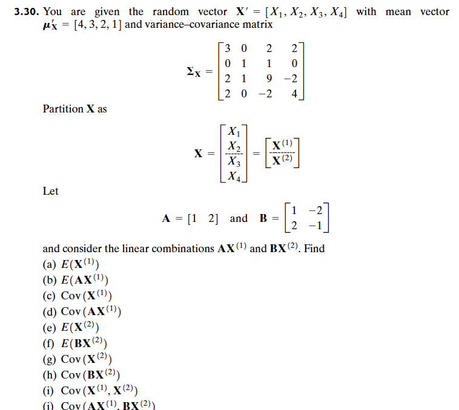
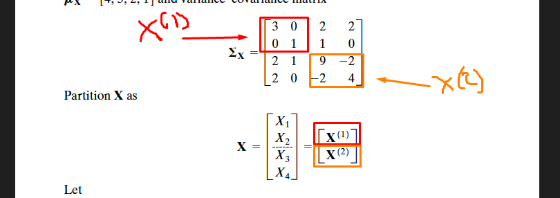
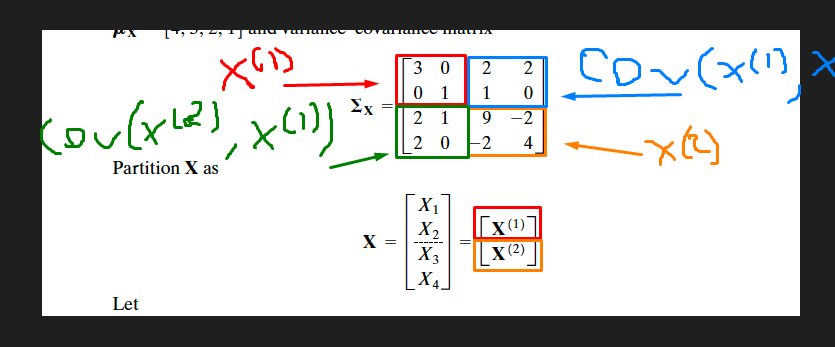

# ex. 4 - Q1



Let us start by defining them in the code:  

```{r}
x_1 <- c(3, 0, 2, 2)
x_2 <- c(0, 1, 1, 0)
x_3 <- c(2, 1, 9, -2)
x_4 <- c(2, 0, -2, 4)
sigma_x = data.frame(
  x_1,
  x_2,
  x_3,
  x_4
)
sigma_x <- data.matrix(sigma_x)


mu <- c(4, 3, 2, 1)

A <- c(1, 2)

col_1 <- c(1, 2)
col_2 <- c( -2, -1)
B <- data.frame(
  col_1, 
  col_2
)
B <- data.matrix(B)

sigma_x
mu
A
B
```


### (a)  
E($X^{(1)}$) <br>
Since the expected value is the same as the mean or $\mu$ we just need to take the partioned $\mu$, which are the two first elements of the list [4, 3, 2, 1]
```{r}
mu[1:2]
```

### (b)  
E(A$X^{(1)}$) <br>  
Here we just need to multiply the partioned mu with A:  
```{r}
A %*% mu[1:2] 
```
### (c)  
Cov($X^{(1)}$)  
To get the partioned variance-covariance matrix we need to look p.78 / 116, but the general case is the following: <br>


```{r}
sigma_x[1:2,1:2]
```
### (d)  
Cov(A$X^{(1)}$), now this is more tricky since we are dealing with the covariance. When scaling a covariance matrix, we need to use the formula on p. 76 (2-45):  
```{r}
A %*% sigma_x[1:2,1:2] %*% matrix(A) # matrix(A) is a way to transpose a vector
```
### (e)
E($X^{(2)}$) <br>
Same as in a, we just partion $\mu$ <br>
```{r}
mu[3:4]
```
### (f)
E(B$X^{(2)}$)
Same as in b, we just multiply B by the partion from previous <br>
```{r}
B %*% mu[3:4]
```

### (g)
Cov($X^{(2)}$) here we just partion it as before: <br>
 <br>
```{r}
sigma_x[3:4, 3:4]
```
### h
Cov(B$X^{(2)}$) we do as in d  
```{r}
B %*% sigma_x[3:4, 3:4] %*% t(B) # t(B) is used instead of matrix(B), since it is matrix not a vector, we are transposing
```

### i
The upper right and the lower left are transposed versions of each other and comprises this the covariances between the partitions p. 78 / 116. In this case we need the upper right matrix <br>
 <br>

```{r}

sigma_x[1:2, 3:4]

```
### j
Here we still use the formula from p. 76, but we are using the formula :  Cov(AX1,BX2)=ACov(X1,X2)t(B) (exercise solutions):  
```{r}
A %*% sigma_x[1:2, 3:4] %*% t(B) 
```

