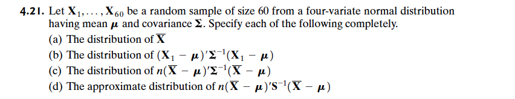

# Q5

## a
The distribution of **$\bar{X}$** (aka. the sample means array p. 9) would likewise follow a normal distribution $N_4(\mu, \quad 1/n \quad \Sigma)$  (p. 121 / 59)

## b
The distribution of **$(X_1 - \mu)´\Sigma^{-1}(X_1 - \mu)$**. These are the contours of the p-dimensional normal distribution (p. 153 or 163), they should, therefore, follow a chi-squared distribution ($X_p^2$) p. 155 like this ($X_4^2$).  

## c  
This is the formula from the central limit theorem, which states that if we have enough data, our the sample mean will converge towards the population mean and it will at the end follow a chi-squared distribution ($X_4^2$), which is a normal distribution for multivariate data (p. 176). 

## d 
This is the formula from the central limit theorem that is used in practice (p. 176). This likewise follows a chi squared distirbution ($X_4^2$) 