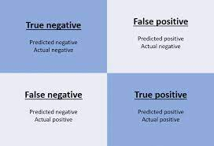

# Poster project
I will do a toy example of my poster project.  

# Step 1: Describe data
What kind of data are we dealing with? What are categorical, what is numerical, what are the attributes, what do we want to classify?

```{r}
full_df <- read.table("T11-9.dat")
full_df$V8 <- as.numeric(as.character(full_df$V8))
full_df
```

The dataset contains the following information: <br>
  - V1: Cereal brand <br>
    - Type: string <br>
  - V2: Manufacturer <br>
    - Type: Categorical String <br>
  - V3: Calories <br>
    - Type: Numerical <br>
  - V4: Protein <br>
    - Type: Numerical <br>
  - V5: Fat <br>
    - Type: Numerical <br>
  - V6: Sodium <br>
    - Type: Numerical <br>
  - V7: Fiber <br>
    - Type: Numerical <br>
  - V8: Carbohydrates <br>
    - Type: Numerical <br>
  - V9: Sugar <br>
    - Type: Numerical <br>
  - V10: Potasium <br>
    - Type: Numerical <br>
  - V11: Group <br>
    - Type: Numerical categorical <br>

The first step will be to remove V1, V2, and V11, since V2 is not interesting for our purposes, and V1 or V2 will be our classification variable (here it will probably be V11). Moreover V8 needs to be converted to numerical <br>

```{r}
df <- full_df[, -c(1, 2, 11)]
df$V8 <- as.numeric(as.character(df$V8))
df <- df[-11,] # contains NA
df
```

    
# Step 2: Descriptive statistics

## Scatter plot
Before we start with anything let us make a scatterplot of the pairs: <br>
```{r}
pairs(df)
```
As the scatterplot above shows, V4 and V5 looks a lot like categorical variables, they might need to be excluded: <br> 

```{r}
df <- df[, -c(2, 3)]
pairs(df)
```

 At a quick glance some of the variables might be correlated:  
- V7 and V10 <br>
- v6 and V8 <br>
- V6 and V9 <br>
- V3 and V10 <br>  


## Mean, variance, co-variance
Let us get some simple stats: <br>
```{r}
#mean(full_df)
colMeans(df)
```
```{r}
cov(df)
```
let us also check the generalized variance:  

```{r}
sum(diag(cov(df)))
```
This is pretty high, but not something that is unexpected given, that some variabels have a high variance.  

Okay, we can now conclude that no variable appears to be completed unrelated, since none are 0. Moreover, V10, V6 have a very high variance, but a low mean, which might indicate, that there are some crazy outliers, the same goes for V3 and V9 to a lesser extend. Let's check them: <br>

```{r}
par(mfrow = c(2, 2))
stripchart(df$V10, main = "V10")
stripchart(df$V6, main = "V6")
stripchart(df$V9, main = "V9")
stripchart(df$V3, main = "V3")
```
Yep we need to keep an eye out for V10's outliers, V6 is not that bad, but still has an outlier. V3 and V9 looks good however.<br> <br>

Now let's check there correlation and let us keep an eye out on those we saw at the scatter plot: <br>
```{r}
cor(df)
```
V7 and V10: 0.93 (Very strong) <br>
V6 and V8: 0.56 (Strong) <br>
V3 and V9: 0.58 (strong) <br>
Let us plot these together <br>

```{r}
margin_dot_plot <- function(x, y, xlabel = "x", ylabel = "y", name = "") {
layout(mat = matrix(c(2, 0, # First column
                      1, 3), # Second column 
                        nrow = 2, 
                        ncol = 2),
       heights = c(6, 2),    # Heights of the two rows
       widths = c(1, 6))     # Widths of the two columns
par(mar = c(4, # Bottom
            4, # left
            0.1, # Top
            0.1))# Right

plot(x, y, xlab = "", ylab = "")
legend("topleft", 
       name,
       cex = 1.5)

stripchart(y, method = "stack", at = 0,
           pch = 16, col = "darkgreen", frame = FALSE, vertical = TRUE, ylab = ylabel)
stripchart(x, method = "stack", at = 0,
           pch = 16, col = "darkgreen", frame = FALSE, xlab = xlabel)
}
```

```{r}
margin_dot_plot(df$V7, df$V10, xlabel = "V7", ylabel = "V10", name = "V7 and V10")
margin_dot_plot(df$V6, df$V8, xlabel = "V6", ylabel = "V8", "V6 and V8")
```
V7 and V10 seems to highly correlated and so does V6 and V8. 

## Conclusion 
V7 and V10 have a strong correlation, and the same goes for V6 and V8. Moreover V10 and V6 appears to have some large outliers, due to a high variance and low mean, which might need to be removed. Moreover, wether intended or not, V4 and V5 appears to behave more like categorical rather than numerical nature and they have been excluded.  

# Step 3: Check for normality
## Each attribute
We start by checking the normality of each attribute:  

```{r}
library(MASS)

get_best_lambda <- function(data_vector, name = "")  {
    # Transform data
    # Make box cox plot on our data
    df_box_cox<- boxcox(data_vector~1,lambda=seq(-2, 2, 1/10))# Can also be seq(-.5, 1.5,.01) 
    
    # Get best lambda
    max_lambda <- df_box_cox$x[which.max(df_box_cox$y)]

    legend("left",
           paste0(name, " Best lambda", "\n",
                  "The best lambda is ", round(max_lambda, 3), "\n"),
           cex = 0.75,
           bty = "n")
    return(max_lambda)
}

box_cox_transformation <- function(data_vector, name = ""){

  lambda <- get_best_lambda(data_vector, name)
  if (lambda == 0){
    transformed_vector <- log(data_vector)
  }
  
  else {
  transformed_vector <- ( (data_vector^lambda) - 1)/lambda
  }
  
  return(transformed_vector)
}


test_norm <- function(data_vector, name = " ", signigicance = 0.05) {
  # You can chose the following significance levels
  # 0.01
  # 0.05
  # 0.10
  
  if (signigicance == 0.01){
    signigicance_col <- 2
  }
    
  else if (signigicance == 0.05){
    signigicance_col <- 3
  }
  
  else if (signigicance == 0.1){
    signigicance_col <- 4
  }
    
  
  # ----- QQ plot -----
  qq <- qqnorm(data_vector, plot.it = F)
  
  # ----- Hypothesis test ------
  # Create Testing table
  n <- c(5, 10, 15, 20, 25, 30, 35, 40, 45, 50, 55, 60, 75, 100, 150, 200, 300)
  one <- c(0.8299, 0.8801, 0.9126, 0.9269, 0.9410,
        0.9479, 0.9538, 0.9599, 0.9632, 0.9671,
        0.9695, 0.9720, 0.9771, 0.9822, 0.9879, 0.9905, 0.9935)
  
  five <- c(0.8788, 0.9198, 0.9389,
        0.9508, 0.9591, 0.9652,
        0.9682, 0.9726, 0.9749,
        0.9768, 0.9787, 0.9801,
        0.9838, 0.9873, 0.9913, 0.9931, 0.9953)
  
  ten <- c(0.9032, 0.9351, 0.9503,
        0.9604, 0.9665, 0.9715,
        0.9740, 0.9771, 0.9792,
        0.9809, 0.9822, 0.9836,
        0.9866, 0.9895, 0.9928, 0.9942, 0.9960)
  testing_tbl <- data.frame(
  n,
  one,
  five,
  ten
  )
  
  # Find index of testing (n)
  sample_size <- length(data_vector)
  i <- 1
  prev_value = NaN
  for (n in testing_tbl$n){
    
    if (sample_size > testing_tbl$n[length(testing_tbl$n)]){
      i <- length(testing_tbl$n)
      break
    }
    
    if (n == sample_size){
      exact_sample_size <- TRUE
      break
    }
    
    else if ( n > sample_size & prev_value < sample_size){
      break
    }
    i <- i + 1
    prev_value <- n 
  }
  
  # ----- Normal -------
  cor_coef <- cor(qq$x, qq$y)
  normality = FALSE
  if (cor_coef >= testing_tbl[i, signigicance_col]){
    plot(qq, xlab = "Theoretical quantiles", ylab = "Sample quantiles", main = paste0(name, " QQ plot"))
    qqline(data_vector)
    legend("topleft",
           paste0("Rq: ", round(cor_coef, 3), "\n",
                  "Test rq: ", testing_tbl[i, signigicance_col], "\n",
                  "Alpha: ", signigicance, "\n",
                  "n: ", n, "\n",
                  "NORMAL!"),
           cex = 0.65,
           bty = "n")
    normality = TRUE
    return(normality)  
  }
  
  # ----- Not normal -----
  else {

    plot(qq, xlab = "Theoretical quantiles", ylab = "Sample quantiles", main = paste0(name, " QQ plot"))
    qqline(data_vector)
    legend("topleft",
           paste0("Rq: ", round(cor_coef, 3), "\n",
                  "Test rq: ", testing_tbl[i, signigicance_col], "\n",
                  "Alpha: ", signigicance, "\n",
                  "n: ", n, "\n",
                  "Not NORMAL!"),
           cex = 0.65,
           bty = "n")
  }
}
```


Now apply above function to each attribute <br>

```{r}
par(mfrow = c(2, 3))
i = 1
for (colname in colnames(df)) {
  test_norm(df[, i], name = colname)
  i = i + 1
}
```
None of the data is normally distributed within alpha = 0.05, let us transform it then: <br> Now since the values must be positive, then we need to remove V6, V7, V9:

```{r}
par(mfrow= c(1, 3))
z_df <- df[, c(1, 4, 6)]
i = 1
for (colname in colnames(z_df)){
  z_df[, i] <- box_cox_transformation(z_df[, i], name = colname)
  i = i + 1
}
```

Let us now test for normality:  

```{r}
i = 1
par(mfrow= c(1, 3))
for (colname in colnames(z_df)){
  test_norm(z_df[, i], name = paste0(colname, " (Transformed) "))
  i = i + 1
}
```
V8 and V10 are normal if we transform them, therefore, we either have to proceed with these two alone or use non normal transformations.  
Howevever, we can also try to exlude the non-positive from V6, V7, V9

```{r}
z_df <- df

i = 1
for (colname in colnames(df)){
  z_df <- subset(z_df, z_df[,i] > 1)
  i = i + 1
}
z_df
```
Let us then transform:  

```{r}
par(mfrow= c(2, 3))
i = 1
for (colname in colnames(z_df)){
  z_df[, i] <- box_cox_transformation(z_df[, i], name = colname)
  i = i + 1
}


i = 1
par(mfrow= c(2, 3))
for (colname in colnames(z_df)){
  test_norm(z_df[, i], name = paste0(colname, " (Transformed) "))
  i = i + 1
}
```
Now they are all normal. So if we want a normal classifer we need to both exclude zero variables from the data set and transform it, other we need a non-normal classifier. Let us continue with the transformed data and see if it is multivariate normal:  

## Attribute pairs
We will test bivariate normality for each pair:  

```{r}
FindcrikChi <- function(n=30, p=2, alpha= 0.05, n_simulations=10000){
    
    cricvec <- rep(0, n_simulations)  #vector for the rQ result collection#
    
    for(i in 1:n_simulations){
        #iteration to estimate rQ#
        numvec <- rchisq(n, p)  #generate a data set of size n, degree of freedom=p#
        d <- sort(numvec)
        q <- qchisq((1:n-0.5)/n, p)
        cricvec[i] <- cor(d,q)      
    }
    
    scricvec <- sort(cricvec)
    cN <- ceiling(n_simulations* alpha) #to be on the safe side I use ceiling instead of floor(), take the 'worst' alpha*N cor as rQ, everything lower than that is deemed as rejection#
    cricvalue <- scricvec[cN]
    result <- list(cN, cricvalue, scricvec)
    return(result[[2]])
}

multi_var_norm <- function(df, sim_cor, alpha, name, remove_outlier = FALSE, n_outliers = 1) {
  
  # Data and parameters
  n <- nrow(df) # observations
  p <- ncol(df) # number of variables
  D2 <- mahalanobis(df,
                    center  = colMeans(df),
                    cov = cov(df),
                    tol=1e-20) # generalized squared distance
  # Removes outliers if necessary
  if(remove_outlier == TRUE){
    
    i = 0
    while (i < n_outliers){
    #This is where we remove outliers. This will most likely change the correlation value and the % number of points in the contour. 
    D2 <- D2[-which.max(D2)]
    i = i + 1
    }
  } 
  
  # Chi square qq plot 
  chi_plot <- qqplot(qchisq(ppoints(n, a = .5), df = p), D2,
                     plot.it = F) # chi square plot values.
  my_cor <- cor(chi_plot$x, chi_plot$y) # correlation value
  critical_value <- qchisq(p = alpha,
                           df = p,
                           lower.tail = F) # calculate critical value
  
  # Proportion of points below alpha value
  prop_within_contour <- round(length(D2[D2 <= critical_value]) / length(D2),4) #

  quantiles <- quantile(D2)
  quantile_25 <- quantiles[2]
  quantile_50 <- quantiles[3]
  quantile_75 <- quantiles[4]
  
  plot(chi_plot, #From here and downwards it is only how you want the plot to look. 
       ylab = 'Mahalanobis distances',
       xlab = 'Chi-square quantiles',
       main = paste0(name, ' alpha = ',alpha)) # plot chi square plot
  
  # Q line
  y <- rchisq(500, df = p)
  qqline(y, distribution = function(n) qchisq(n, df = p), prob = c(0.1, 0.6))
  
  # Lines for quantiles
  abline(h = quantile_50, lty = 2) # 50% quantiles becayse book p. 187
  abline(h = critical_value, lty = 2, col = "red") # Below Critical value
  
  if(my_cor > sim_cor){
    conclusion <- "Normally distributed!"
  }
  
  else {
    conclusion <- "NOT normally distributed!"
  }
  legend("topleft", 
         paste0("r = ", round(my_cor,4), "\n",
                "Simulated r Value: ", sim_cor, "\n",
                "% Below critical range: ", prop_within_contour, "\n",
                "Expected if normal: ", 1-alpha, "\n",
                conclusion),
         cex = 0.75,
         bty = "n") # add legend to plot
}


bivar_pairs <- function(data_frame, significance = 0.05, remove_outliers = FALSE, n_outliers = 1, n_simulations = 10000) {

sim_cor <- FindcrikChi(n = length(data_frame[,1]),
                          p = 2,
                          alpha = significance,
                          n_simulations)

prev <- c()
i = 1
for (col_name in colnames(data_frame)){

  j = 1
  for (col_name_inner in colnames(data_frame)){
    
    if (i == j){
      j = j + 1
      next
    }
    
    else if (j %in% prev){
      j = j + 1
      next
    }
    
    else{
      multi_var_norm(df = data_frame[, c(i, j)],
                 sim_cor = sim_cor,
                 alpha = significance,
                 name = paste0(col_name, " & ", col_name_inner, " "),
                 remove_outlier = remove_outliers,
                 n_outliers = n_outliers)
      
    }
    j = j + 1
  }
  prev <- append(prev, i)
  i = i + 1
  }
}
```


```{r}
par(mfrow = c(3, 5))
bivar_pairs(z_df)
```
```{r}
bivar_pairs(z_df)
```
The following pairs are not normal:<br>
  - V6 and V9 <br>
  - V7 and V9 <br>
  
We either have to remove outliers from V9 or just remove the whole attribute:  

```{r}
bivar_pairs(z_df, remove_outliers = TRUE, n_outliers = 2)
```
Okay, this suggest, that we need to remove V9 completely.  
```{r}
z_df <- z_df[, -5]
z_df
```

## All attributes
```{r}
sim_cor <- FindcrikChi(n = length(z_df[,1]),
                          p = length(colnames(z_df)),
                          alpha = 0.05,
                          10000)

multi_var_norm(z_df, sim_cor, 0.05, "V3, V6, V7, V8, V10")
```
Okay, so we need to drop V9, and then we have a multivariate distribution, however, remember, that we removed some rows where V0 was 0, so let us now, start from the complete beginning and do the same test:  

```{r}
z_df <- df[, -5]

i = 1
for (colname in colnames(z_df)){
  z_df <- subset(z_df, z_df[,i] > 1)
  i = i + 1
}
z_df
```

```{r}
par(mfrow= c(2, 3))
i = 1
for (colname in colnames(z_df)){
  z_df[, i] <- box_cox_transformation(z_df[, i], name = colname)
  i = i + 1
}


i = 1
par(mfrow= c(2, 3))
for (colname in colnames(z_df)){
  test_norm(z_df[, i], name = paste0(colname, " (Transformed) "))
  i = i + 1
}
```
Yep they are still normal.  
Let us test bivariate normality:  

```{r}
par(mfrow = c(3, 5))
bivar_pairs(z_df)
```


```{r}
bivar_pairs(z_df)
```
All the pairs are normal. Let us check for all attributes:  

```{r}
sim_cor <- FindcrikChi(n = length(z_df[,1]),
                          p = length(colnames(z_df)),
                          alpha = 0.05,
                          10000)

multi_var_norm(z_df, sim_cor, 0.05, "V3, V6, V7, V8, V10")
```

They are likewise normally distributed.  

## Conclusion
This gives us three options <br>
  - option 1: Use the dataframe with V3, V6, V7, V8, V9, V10, without any transformations. This is not normally distributed, but retains most of its attributes. <br>
  - Option 2: Use the data frame V3, V8, V10 transformed, since these are normally distributeed <br>
  - Option 3: Use the data frame V3, V6, V7, V8, V10 as transformed and where the 0s are removed from from V6, V7 since these are normally distributed. 
  
```{r}
# option 1
opt_1 <- df
opt_1
```
```{r}
#option 2
par(mfrow = c(1, 3))
opt_2 <- df[, c(1, 4, 6)]
i = 1
for (colname in colnames(opt_2)){
  opt_2[, i] <- box_cox_transformation(opt_2[, i], name = colname)
  i = i + 1
}
opt_2
```


```{r}
#option 3
opt_3 <- z_df
opt_3
```
However, I have decided to only use  option 2 for normal classifiers, since I believe that to many observatsion have been removed from option 3 (there are only 16 observations left out of the 42 observations).


# Step 4: Find Optimal classifier
I will follow the following process: <br>
 <br>

## Optimal Classifier
I Will first split and prepare my data:

```{r}

z_opt_2 <- full_df
z_opt_2_cat <- full_df[, 11]

par(mfrow = c(1, 3))


opt_2_group_1 <- subset(z_opt_2, full_df[,11] == 1)
opt_2_group_2 <- subset(z_opt_2, full_df[,11] == 2)
opt_2_group_3 <- subset(z_opt_2, full_df[,11] == 3)

opt_2_group_1 <-opt_2_group_1[, c(3, 8, 10)]
opt_2_group_2 <-opt_2_group_2[, c(3, 8, 10)]
opt_2_group_3 <-opt_2_group_3[, c(3, 8, 10)]

opt_2_group_1
opt_2_group_2
opt_2_group_3
```
Now we need to test normality. However, it appears that V3 is causing problems, so we will remove it<br>


```{r}
opt_2_group_1
opt_2_group_2
opt_2_group_3
```

```{r}
par(mfrow = c(1, 2))
# Group 1
sim_cor <- FindcrikChi(n = length(opt_2_group_1[,1]),
                          p = length(colnames(opt_2_group_1)),
                          alpha = 0.05,
                          10000)
#multi_var_norm(opt_2_group_1, sim_cor, 0.05, "Group 1, V3, V8, V10 ")

# Group 2
sim_cor <- FindcrikChi(n = length(opt_2_group_2[,1]),
                          p = length(colnames(opt_2_group_2)),
                          alpha = 0.05,
                          10000)
multi_var_norm(opt_2_group_2, sim_cor, 0.05, "Group 2, V3, V8, V10 ")

# Group 1
sim_cor <- FindcrikChi(n = length(opt_2_group_3[,1]),
                          p = length(colnames(opt_2_group_3)),
                          alpha = 0.05,
                          10000)
multi_var_norm(opt_2_group_3, sim_cor, 0.05, "Group 3, V3, V8, V10 ")
```
Since we can't check group one we should assume that it is not normally distributed, however in this case let us assume it is normal just for demonstration.   


Now we know that the two groups are normal, so now we need to test their covariance matrices using the Box-m test for homogeneity.
https://www.youtube.com/watch?v=VvHdjRKXui8&ab_channel=Dr.ToddGrande. We have the following hyptehis (p. 311) <br>
- h0: hypothesis: The covariance matrices are equal <br>
- h1: The covariance matrices differ.  

If p is less than 0.001 then we reject h0 otherwise we accept it.  <br> 

```{r}
library(heplots)
boxM(z_opt_2[, c(3, 8, 10)], z_opt_2[, 11])

```
As the example above show, our be value is above 0.001, so we failed to reject the null hypothesis, and we can assume that the covariance matrices do not differ significantly.

This means, that we should use the LDA or Linear Discriminant Analysis, but it might not be best but in theory it is. What this does, like QDA, is that they try to Minimize ECM or the Expected costs of misclassification by creating a hyperplane which is used to seperate between the classes. 


```{r}
z_opt_2 <- full_df
z_opt_2[, 3] <- box_cox_transformation(z_opt_2[, 3], name = "V3") 
z_opt_2[, 8] <- box_cox_transformation(z_opt_2[, 8], name = "V8")
z_opt_2[, 10] <- box_cox_transformation(z_opt_2[, 10], name = "V10")
z_opt_2 <- z_opt_2[-11,]
z_opt_2 <- z_opt_2[, c(3, 8, 10, 11)]
```


## Creating classifers and evaluating

## 70 - 30 split and APER
We split into training and test data <br>
```{r}
z_opt_2_train <- z_opt_2[sample(1:nrow(z_opt_2), 30),] # 70%
z_opt_2_test <- z_opt_2[sample(1:nrow(z_opt_2), 12),] # 30%
```

We then have some simple evalutaion techniques such as APER (misclassifications divided by number of samples)

```{r}
aper <- function(preds, obs){
  n_misclassifications <- 0
  i <- 1
  for (val in preds){
    
    if (val != obs[i]){
      n_misclassifications = n_misclassifications + 1
    }
    
    i = i + 1
  }
  return(n_misclassifications / length(preds))
  
}

acc <- function(preds, obs){
  correct <- 0
  i <- 1
  for (val in preds){
    
    if (val == obs[i]){
      correct = correct + 1
    }
    
    i = i + 1
  }
  return(correct / length(preds))
}

confusion_matrix <- function(preds, observed){
  # Alternatively user this code below
  # library(caret)
  # confusionMatrix(as.factor(predictions$class), as.factor(observed))
  return(table(preds, observed))
}
```

### LDA
We start by creating the LDA model: 
```{r}
library(MASS)
lda_model <- lda(V11~., data = z_opt_2_train)
lda_model
```
The prior probabilities are used for the  ECM, since they give weight to each of the groups, since group two is larger it has a
Let us now predict.

```{r}
lda_preds <- predict(lda_model, z_opt_2_test)
lda_preds
```
#### Evaluate LDA
```{r}
aper(lda_preds$class, z_opt_2_test$V11)
```
It has a very high misclassification rate, it actually misclassifies the majority of the classes!  
```{r}
acc(lda_preds$class, z_opt_2_test$V11)
```
The accuracy is all the way down at 41,6% which is pathetic. 
```{r}
#library(caret)
# confusionMatrix(as.factor(lda_preds$class), as.factor(z_opt_2_test$V11))
confusion_matrix(lda_preds$class, z_opt_2_test$V11)
```
We can see that class 1 is prone to misclassificaitons.
### QDA
```{r}
library(MASS)
qda_model <- qda(V11~., data = z_opt_2_train)
qda_model
```
```{r}
qda_preds <- predict(qda_model, z_opt_2_test)
qda_preds
```
#### Evaluate QDA
```{r}
aper(qda_preds$class, z_opt_2_test$V11)
```
It has a lower misclassification rate, it "only" misclassifes 30% of the classes 
```{r}
acc(qda_preds$class, z_opt_2_test$V11)
```
The accuracy is 66% which is at least better than hald
```{r}
#library(caret)
# confusionMatrix(as.factor(lda_preds$class), as.factor(z_opt_2_test$V11))
confusion_matrix(qda_preds$class, z_opt_2_test$V11)
```
THis time class 3 is prone to misclassifications

### Logistic Regression
```{r}
library(nnet)
logistic_train <- z_opt_2_train
logistic_train$V11 <- as.factor(logistic_train$V11)
logistic <- multinom(V11~., data=logistic_train)
logistic
```
```{r}
logistic_preds <- predict(logistic, z_opt_2_test, type = "class")
logistic_preds
```
#### Evaluate Logistic
```{r}
aper(logistic_preds, z_opt_2_test$V11)
```
It is basically horrible, since it misclassifies more than 2/3 classes

```{r}
acc(logistic_preds, z_opt_2_test$V11)
```
The accuracy is 33% which is at least terrible
```{r}
#library(caret)
# confusionMatrix(as.factor(lda_preds$class), as.factor(z_opt_2_test$V11))
confusion_matrix(logistic_preds, z_opt_2_test$V11)
```
Most are classified wrongly

## E(AER)
This is also known as cross-validation or hold-one-out. Let us define a function for it:  

```{r}
EAER <- function(data_frame, model_type = "lda") {
  
  n_misclass <- 0
  for (i in 1:nrow(data_frame)) {
    temp_data <- data_frame[-i,]
    if (model_type == "lda"){
      model <- lda(V11~., data = temp_data)
    }
    else if (model_type == "qda"){
      model <- qda(V11~., data = temp_data)
    }
    else {
      temp_data$V11 <- as.factor(temp_data$V11)
      model <- multinom(V11~., data=temp_data, trace = FALSE)
    }
    pred <- predict(model, data_frame[i,], type = "class")
    
    if (model_type != "lda" & model_type != "qda"){
      true_prediction = (pred != data_frame[i,4])
      
    }
    else{
      true_prediction = (pred$class != data_frame[i,4])
    }
    
    if (true_prediction){
      n_misclass <- n_misclass + 1
    }
  }
  return(n_misclass / length(data_frame[,1]))
  
}

# Below is how to do it with the built in function
```

Let us evaluate each model:  
#### LDA
```{r}
lda_eaer <- EAER(z_opt_2, "lda")
lda_acc <- 1 - lda_eaer
print(paste0("EAER: ", lda_eaer," Acc: ", lda_acc))

model <- lda(V11~., data = z_opt_2, CV = TRUE)
aper(model$class, z_opt_2$V11)
```
It misclassifies around 66% and has an accuracy of 33%, so all in all pretty terrible.

#### QDA
```{r}
qda_eaer <- EAER(z_opt_2, "qda")
qda_acc <- 1 - qda_eaer
print(paste0("EAER: ", qda_eaer," Acc: ", qda_acc))

model <- qda(V11~., data = z_opt_2, CV = TRUE)
aper(model$class, z_opt_2$V11)
```
The QDA has a slightly lower misclassification rate, but still very close to just guessing.  

#### Logistic
```{r}
logi_eaer <- EAER(z_opt_2, "logistic")
logi_acc <- 1 - logi_eaer
print(paste0("EAER: ", logi_eaer," Acc: ", logi_acc))
```

As before we can see that this model is terrible.

## ROC
ROC (Receiver Operating Characteristic Curve). But it only works with two classes so we will remove class three since it anyways have so few observations.
it works by looking at the true positives and false positives:  
 <br>


```{r}
roc_data <- df2<-z_opt_2[!(z_opt_2$V11==3), ]
library(ROCR)
model <- lda(V11~., data = roc_data, CV = TRUE)
predictions <- as.numeric(model$class)
labels <- roc_data$V11
pred <- prediction(predictions, labels)
perf <- performance(pred, "tpr", "fpr")
auc <- performance(pred, measure = "auc")

plot(perf,
     avg= "threshold",
     colorize=TRUE,
     lwd= 3,
     main= "ROC AUC curve")
legend("topleft",
       paste0("AUC: ", auc@y.values[[1]]))


#per.auc
```

ROC is a way to summarize which threshold we should set for binary classification. It is a convenient way compared to having a bunch of different confusion matrices. It tells have many true positves and false positives we will have for each threshold. The larger the area under the curve (THE AUC) the better it can only be between 1 and 0, and mine is only 0.3 so pretty bad. O let us say that it is very importatn to classify true positives. I.e. that we need to classify group two correctly, all the time. Let us look at the confusion matrix to give us a clearer clue:  
```{r}
confusion_matrix(predictions, labels)
```
In that case our threshold should be 1.8 (green line), because our true postive rate will be 100% and our false positives will likewise be 100%, that is we will classify all as two. If we go a bit higher to 3 (red line), we will end up classifying fever as true positives but almost have just as many false positives. Our current model almost exlusive classifying every as two.

## Conclusion
In conclusion the best model for option 2 data is the QDA, but it is still at terrible model. 

## PCA
Lastly we will finish up with PCA on the dataframe from original but with characters and categorical data excluded.:  

```{r}
pca <- prcomp(df)
pca
```
This does not tell us much, we need the summary

```{r}
summary(pca)
```
So as we can see the first two principal components can explain 96.86% percent of the variance, and the first three can explain 99.7%. This is maybe not as usefull now, but imagine we had millions of variables, then we could reduce them to the principal componens and only work with these for the classification. 

We can see how many we need with a screeplot:  
```{r}
screeplot(pca, type="l")
```

The goal is to find the elbow point, which is around three, so we need three principal compnents, not two.

We can also scale the components:  
```{r}
z_pca <- prcomp(df, scale = T)
z_pca
```

```{r}
summary(z_pca)

```

```{r}
screeplot(pca, type="l")
```

We likewise need three but we will end up accounting for less of the variance with the scaled version.  

